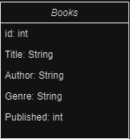
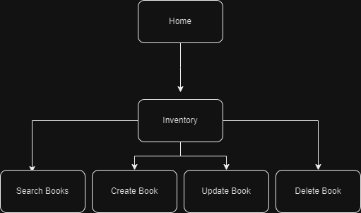
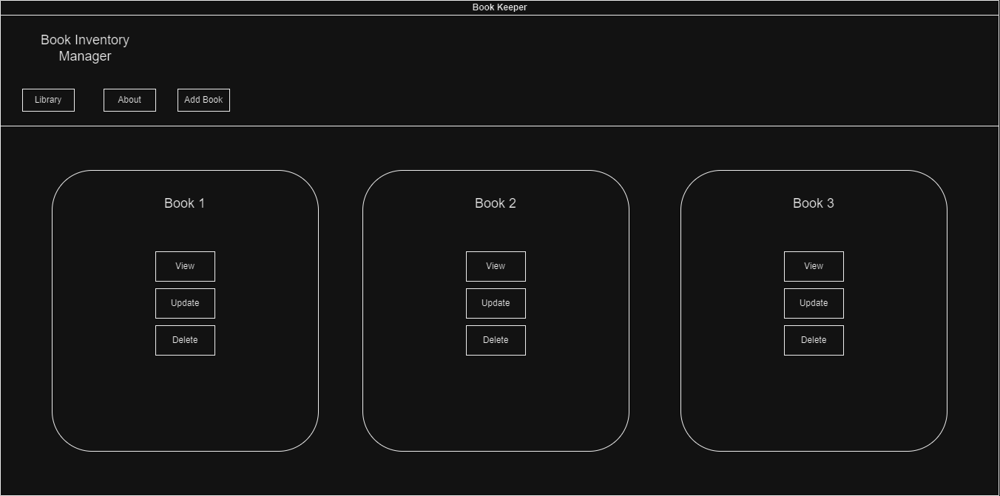
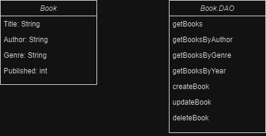

# Milestone 2
## Book Inventory App

## About
This application will allow the user to browse an existing inventory of books, make searches based on multiple criteria,
add new books, and update & delete existing books.

## Functionality Requirements
- As a developer, I would like to have access to a database of books.
- As a developer, I want to be able to view book details and metadata.
- As a developer, I would like to add new books to the existing database.
- As a developer, I want to be able to update and delete existing books.
- As a developer, I would like to be able to search for books by title, author, and genre.

## Database ER Diagram

## Sitemap

## Wireframe

## UML Classes

## REST API Endpoints

### Get books
    Get /books/
### Get books by Author
    Get /books/author
### Get books by Genre
    Get /books/genre
### Get books by title
    Get /books/title
### Get books by id
    Get /books/id
### Create book
    Post /books/
### Update book
    Put /books/
### Delete book
    Delete /books/