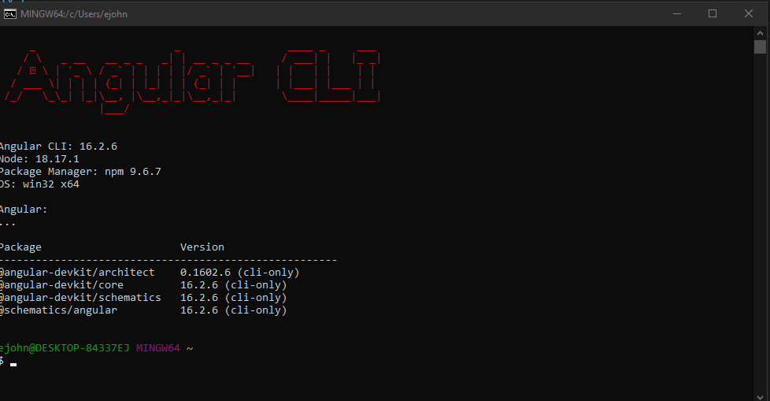
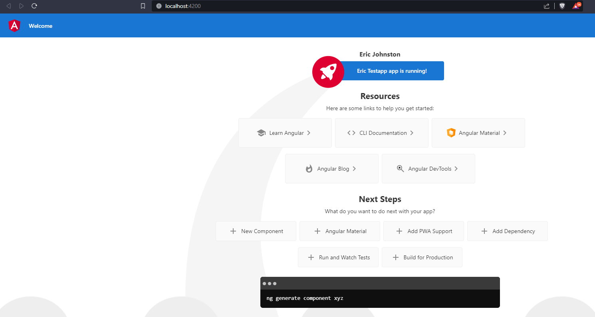
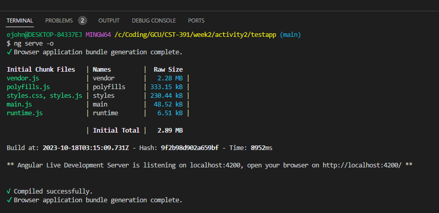

# Angular Tools & First App

## Screenshots

- Angular CLI version check

- Adjusted component template

- Application launched

## Research Questions
### Project Files & Folder Structure
- /node_modules: Contains all npm packages for the workspace.
- /src: The root-level of the application
- /src/app: Contains Angular templates, components, and styles. Also has app logic and data.
- /src/environments: Contains the configuration file which allows for changing between production or development environments.
- /src/assets: Holds all assets for the application, such as images and videos.
- angular.json: Provides workspace-wide and project-specific configuration defaults which are used for build and development tools provided by the Angular CLI.
- package.json: Contains the metadata of the entire project, as well as all dependencies required for the application.
- tsconfig.json: The TypeScript configuration for projects in the workspace.
### Default Angular Page
- The default angular page is displayed from the <app-root> tag which is specified in the components selector property. This specifies which template to use. app.component has a css element for styling, an html element for creating templates, and a TypeScript element for defining the app logic.
