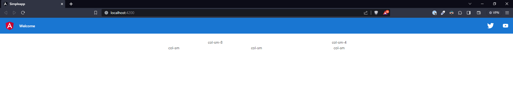
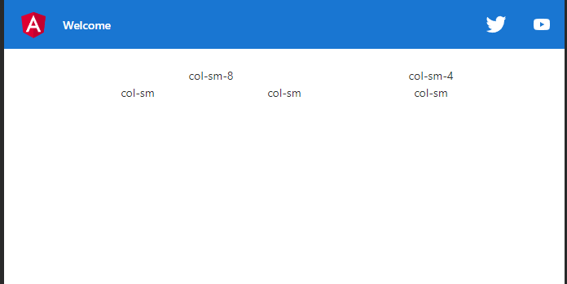
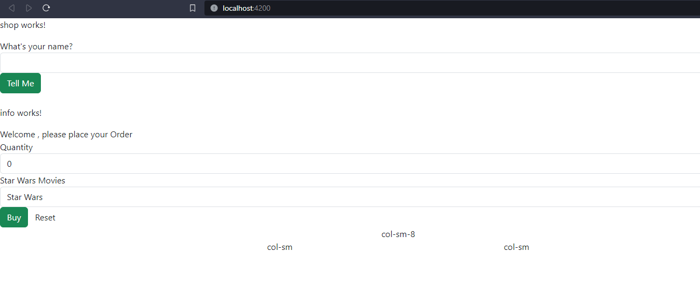
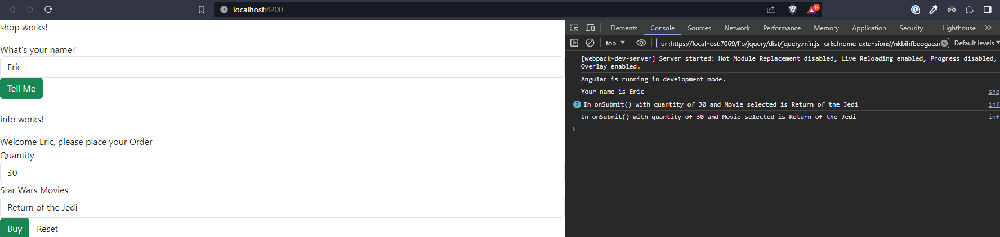
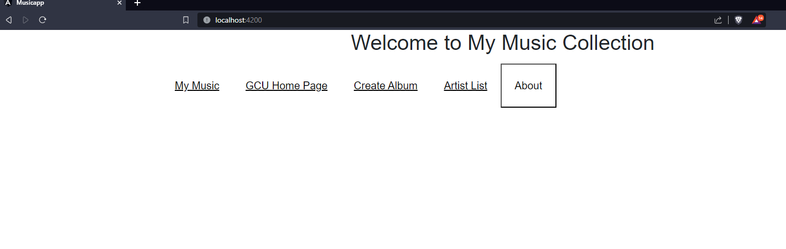
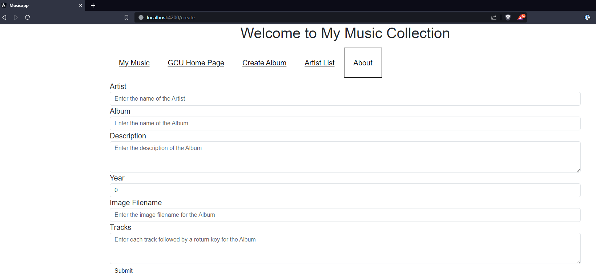
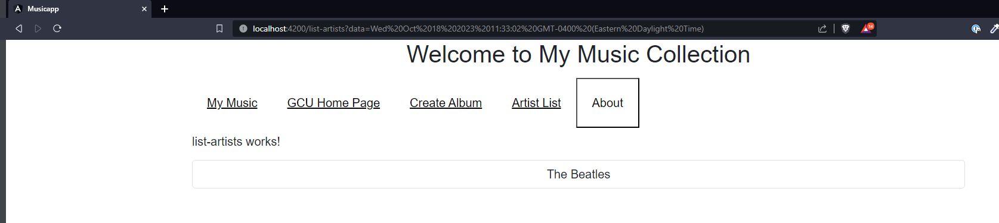
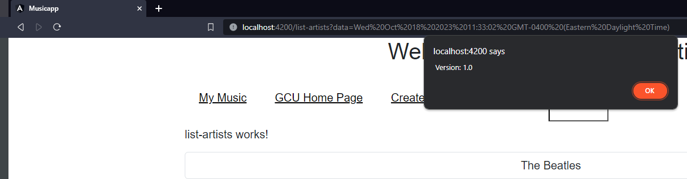

# Activity 3

## Part 1
### Screenshots

- Large responsive grid

- Small responsive grid

- Shop and Info components with nothing entered

- Shop and Info components with name entered and order placed

### Research Questions
 ##### @Input
@Input decorator is used to pass data from the parent component to the child component. In this case, we passed the name from the shop to the info component.
 ##### [value]
   This is used to bind an elements property and assign it a value.
  ##### [(ngModel)]
  The ngmodel binds the value of HTML controls to app data. We use this bind the value of an input field to a variable created in Angular.

## Part 2
### Screenshots

- Initial application page

- GCU Home Page using link in app navbar

- Create Album Page

- Artist List Page

- About Box