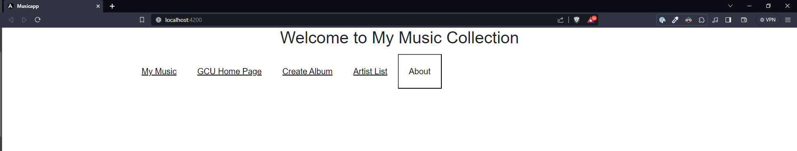
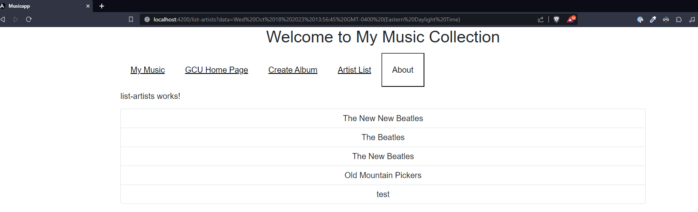
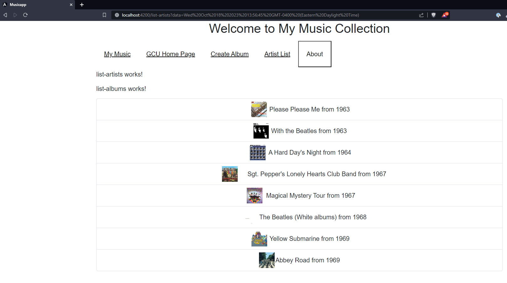
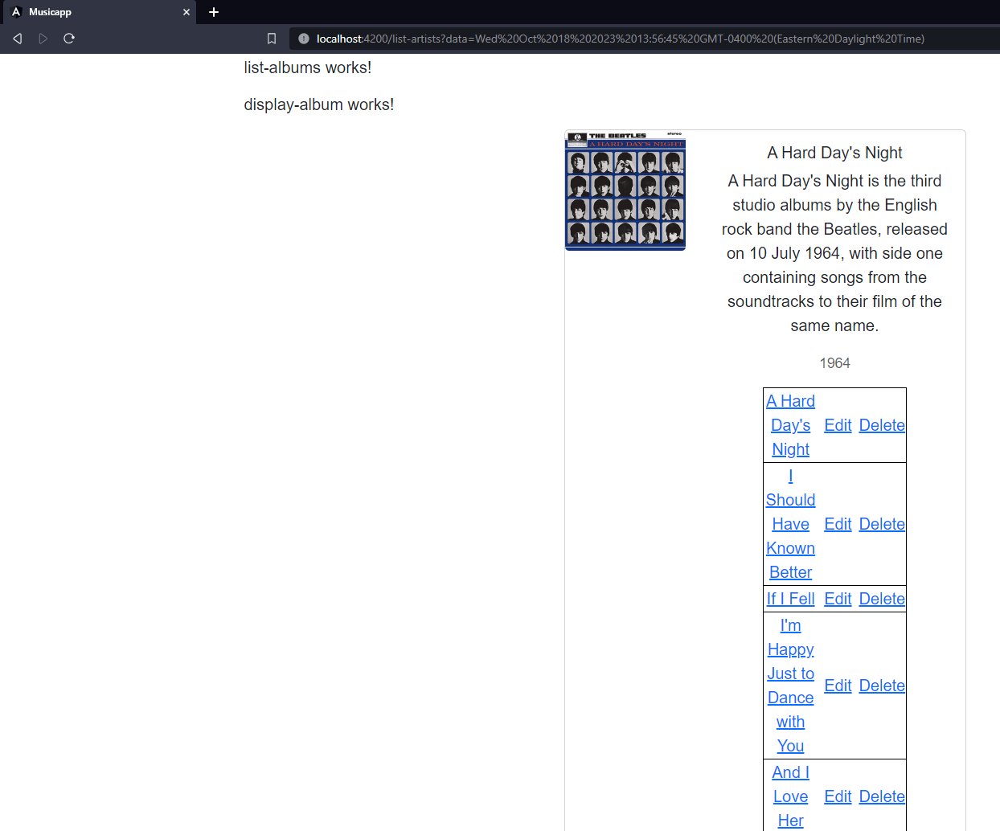
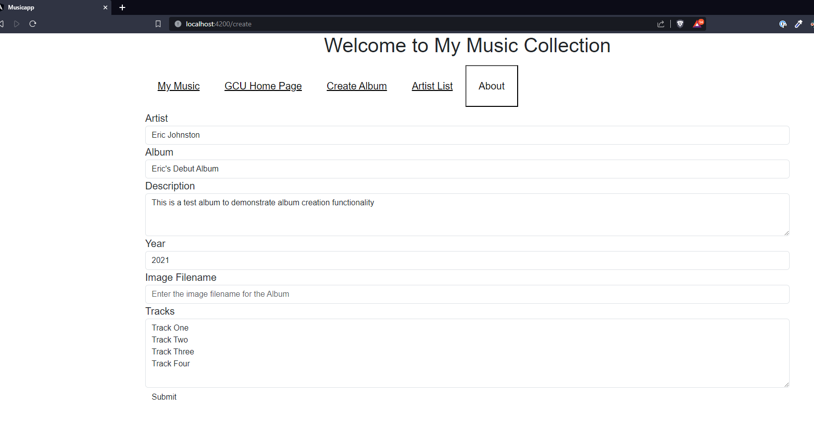
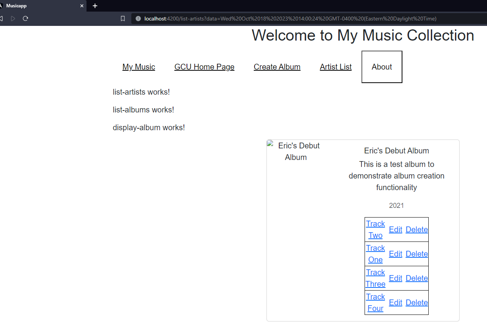

# Activity 4
## Screenshots

- Main Application page

- Artist List page

- Album List page

- Track Display

- Add Album page

- Added album showing tracks

## Research Question
### How does an Angular app maintain a logged state and how does it communicate this state to a server?
State Management is a term that defines a way we can store data, modify it, and react to its changes. Angular state management uses libraries such as NGRX and NGXS. It communicates this state to the server via the URL.