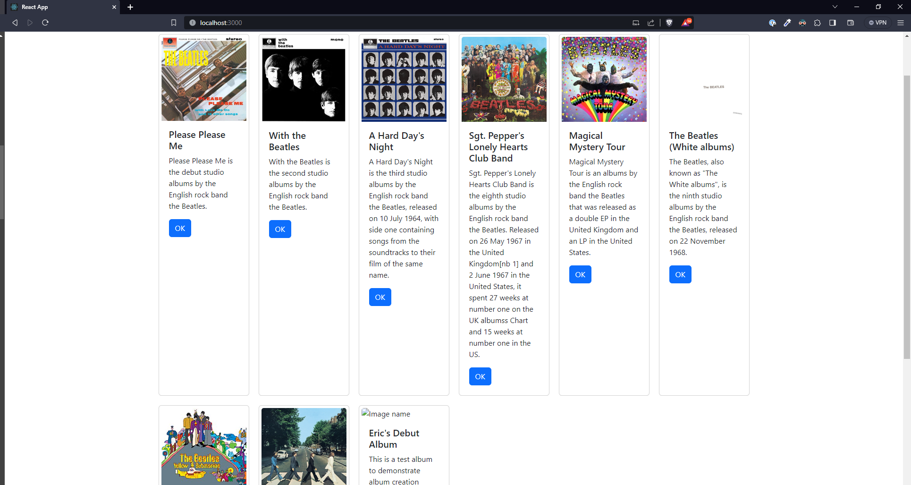
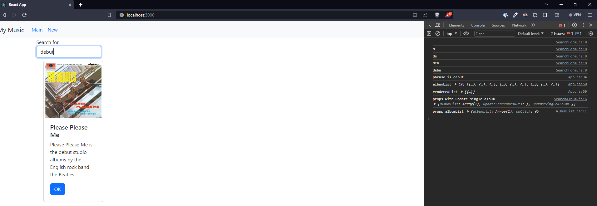
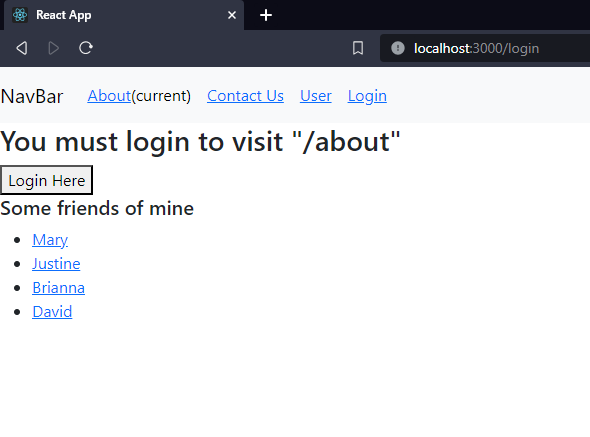
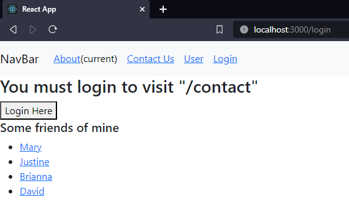
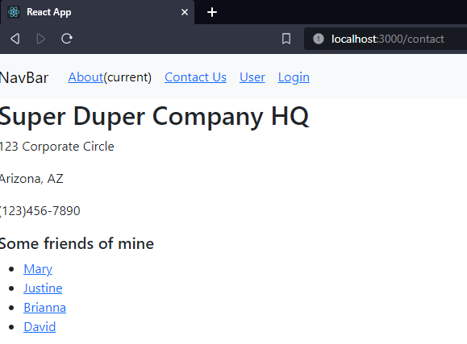
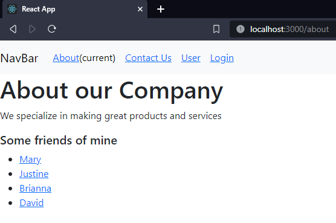
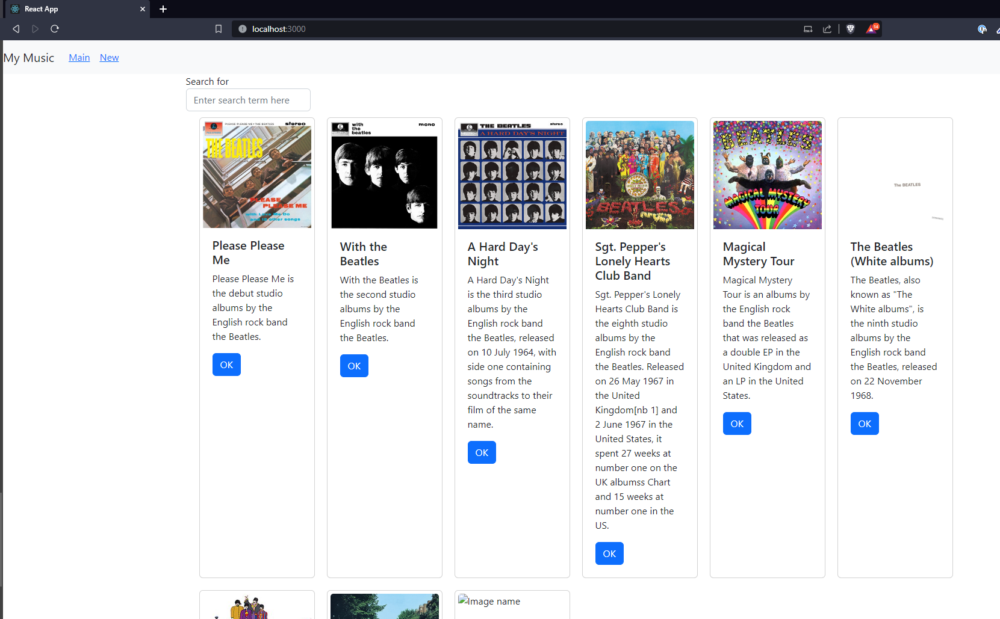
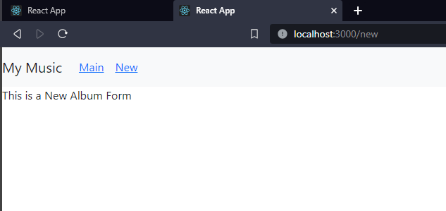
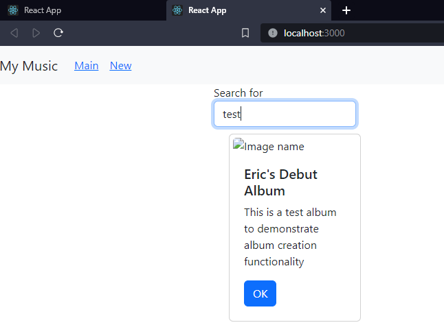

# Activity 6
## Part 1 - External Data Source
### Screenshots

- Music React app connected to MusicAPI from [Activity 1](../week1/MusicAPI/).

- Searching for phrase "debut".

### Part 1 Summary
In part 1 of the activity, we connected the React music app to the MusicAPI that we created in [Activity 1](../week1/MusicAPI/). This was accomplished
by using a hook to set and update the album list. We also used a useEffect() function to set a new state for the album list. Search functionality was added
and we implemented onChange and onSubmit event handlers to display the state of the searchFrom component.

## Part 2 - Routing App Demo
### Screenshots

- Trying to access /about and /contact without logging in.

- /about and /contact contents displayed once logged in.

### Part 2 Summary
In part 2, we used the React routing library to demo how routing can be used to prevent unauthorized users from entering protected routes.
This was accomplished by creating a PrivateRoute component.

## Part 3 - Navigation Routing
### Screenshots

- Main page

- New album route

- Filter search

### Part 3 Summary
For the final part of the activity, we created a new component called AlbumList which contained our card components. We also created a SearchAlbum component
which is used in App.js
