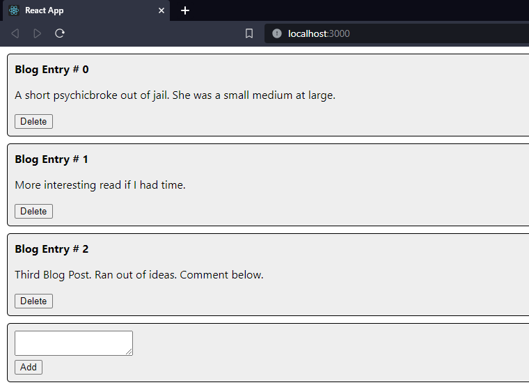
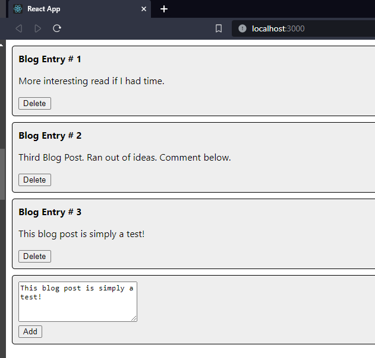

# Activity 7
## Part 1 - Dynamic Components
### Screenshots

- Blog App home page

- Page after deleting blog post #0

- Page after adding a new blog post

## Part 3 - Create New Album
### Screenshots

- Create new album form

- New album added to AlbumList

### Summary
In this part of the activity we created an AddAlbum component using a bootstrap form template. We used the data from the form and pass it on to our database
and API.

## Part 4 - Edit an Album
### Screenshots

- Edit Album Form

- Updated album appears in AlbumList

### Summary
In this part of the activity, we added the ability to edit albums. Essentially we send the proper data to call a put command to our API.